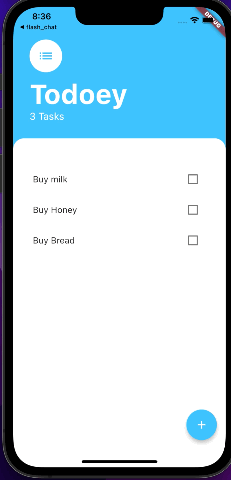

# to-do App Flutter

## Application Demo

## About
This applicaiton uses state management to keep track of task that need to be done. You can mark off assignments by pressing on the checkbox or uncheck them. To fully delete item you need to "longpress" to completly delete. 
